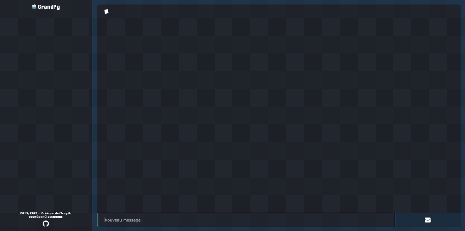
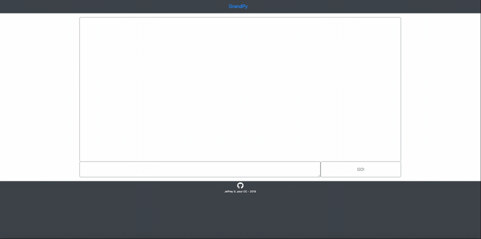

# P7v2

## Qu'est-ce que c'est ?

<div style="text-align: center">
    <br>
</div>

Ce dépot contient GrandPy, **une application web** monopage responsive créé dans le cadre du parcours développeur d'application Python d'OpenClassrooms. Elle constitue le 7ème projet de ce parcours, d'où le nom P7v2 du dépot.

Cette application contient un robot conversationnel, lui aussi appelé **GrandPy 🤖**, capable de répondre à quelques questions et messages envoyés par l'utilisateur tel que :
- *Salut !*
- *Quel est le temps d'aujourd'hui ?* 
- *Tu connais l'adresse d'Openclassrooms ?*
- *Jouons à pile ou face !*

Certaines de ces réponses sont construites avec l'aide d'informations provenant d'API de sites telles que Google Maps ou Wikipédia.

Cette application est optimisée pour Chrome 84 et Safari 13.

## Une version 2 ?

<div style="text-align: center">
    
</div>

Ce projet est une refonte significative du P7 initial (photo ci-dessus) disponible dans *[ce depot github](https://github.com/Ludophilia/P7)* et dont le resultat est consultable sur *https://grandpy-p7.herokuapp.com*.

Cette nouvelle version apporte de nombreuses améliorations telles que :
- Un **design plus esthétique**, qui occupe mieux la hauteur d'écran disponible et s'adapte mieux à la consultation sur mobile grâce à l'ajout d'un [design dédié](v2_mob_1.gif).
- Une **meilleure expérience utilisateur**, grâce à l'ajout entre autres : 
    - d'un message d'accueil qui explique les fonctionnalités de l'application
    - d'une zone d'input message qui se redimensionne automatiquement
    - d'un script pour rendre le dernier message de la conversation toujours visible lors de la rédaction d'un message
    - de cartes google maps qui ne gênent plus le scrolling
- De **nouvelles fonctionnalités** : GrandPy peut désormais donner la météo du lieu où réside l'utilisateur, l'heure qu'il est, décrire comment il va…

La partie sous le capot n'en est pas reste puisque :
- les **frameworks *inutiles*** telles que Bootstrap et Jquery ont été **retirés** autant pour des raisons d'apprentissage (maitrise des bases du dev web) que de taille.
- Le **code** est encore mieux **documenté** avec l'ajout de commentaires, doctstring et un effort fait sur le nommage.
- Le **code** est mieux **structuré** : ainsi par exemple, les réponses de GrandPy ont été retirées de la partie client et stockées dans un fichier à part, de même que les expressions régulières utilisées pour analyser les messages utilisateur.
- **L'algorithme** d'analyse et de traitement des messages utilisateur à été **amélioré**.
- La **logique** d'affichage des messages au niveau client a été **revue** et **améliorée**.

## Comment ça marche ?

### Logique générale

L'application peut être séparée en deux parties qui communiquent ensemble via HTTP:
- La partie **client**, accessible via un navigateur web compatible, est en charge de l'envoi des messages tapés par l'utilisateur, de la réception des messages envoyé par le robot, et de l'affichage de la conversation qui en resulte.
- La partie **serveur** héberge aussi le robot GrandPy qui traite les messages qui lui sont envoyés par le client, fait des appels à des API tierces quand nécessaire et renvoie la réponse appropriée. Naturellement, elle héberge aussi la partie client de l'application et la sert à l'utilisateur lorsque l'utilisateur accède à l'adresse dédiée.

### Langages, modules et API

#### Partie client:
- HTML5 
- CSS3 
- Vanilla JavaScript 

#### Partie serveur:
- Python 3.6 
- avec le web framework Flask 
- et d'autres modules à voir dans requirements.txt (requests...)

#### API : 
- **Google Maps** ([doc1](https://developers.google.com/maps/documentation/javascript/overview), [doc2](https://developers.google.com/places/web-service/search)) pour l'affichage d'une carte interactive et la récupération d'une adresse
- **Wikimedia** ([doc](https://www.mediawiki.org/wiki/API:Get_the_contents_of_a_page)) pour des informations supplémentaire sur un certain lieu à partir d'une page Wikipédia
- **OpenWeatherMaps** ([doc](https://openweathermap.org/api)) pour des informations météorologiques

#### CDN : 
- **FontAwesome** ([doc](https://fontawesome.com/v4.7.0/get-started/)) pour les icônes 

## Comment ça s'installe ?

**Aucune installation est nécessaire**, l'app est accessible à l'adresse : https://grandpy-remake.herokuapp.com/

Il est bien sûr possible de **télécharger le projet sur sa machine** et de le lancer sur un serveur local par exemple, pour cela il pourrait être nécessaire d'installer :
- Python 3.6+ ([doc](https://www.python.org/downloads/))
- Le gestionnaire de package pip ([doc](https://pypi.org/project/pip/))

Par la suite, depuis le terminal (bash et dérivés) et **la racine du projet**:

1. Installer un gestionnaire d'environnement (virtualenv par exemple) si nécessaire:

    ```bash
    pip install virtualenv
    ```
2. Créer un environnement virtuel, "env" par exemple:

    ```bash
    virtualenv env
    ```

3. Lancer l'environnement virtuel (env est le nom d'environnement choisi précédemment):

    ```bash
    source env/bin/activate
    ```

4. Une fois l'environnement virtuel lancé, télécharger les dépendances dans requirements.txt :

    ```bash
    pip install -r requirements.txt
    ```

5. De nouvelles clés API seront aussi nécessaires pour accéder aux différentes API dont dépend ce projet, voir les documentations fournisseur dans la [section précédente](#api-) pour plus d'informations.

5. Une fois les clés récupérées et ajoutées au fichier de config (`config.py`), pour lancer le serveur web, toujours depuis la racine du projet:

    ```bash
    flask run 
    ````

   Par défaut, l\'app se trouve à http://127.0.0.1:5000/.